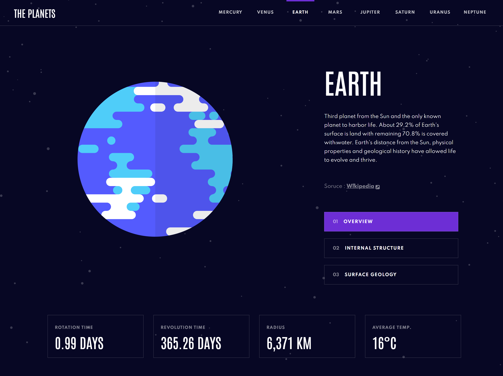

# Frontend Mentor - Planets fact site solution

This is a solution to the [Planets fact site challenge on Frontend Mentor](https://www.frontendmentor.io/challenges/planets-fact-site-gazqN8w_f). Frontend Mentor challenges help you improve your coding skills by building realistic projects. 

## Table of contents

- [Overview](#overview)
  - [The challenge](#the-challenge)
  - [Screenshot](#screenshot)
  - [Links](#links)
- [My process](#my-process)
  - [Built with](#built-with)
  - [What I learned](#what-i-learned)
  - [Continued development](#continued-development)
  - [Useful resources](#useful-resources)
- [Author](#author)

## Overview

### The challenge

Users should be able to:

- View the optimal layout for the app depending on their device's screen size
- See hover states for all interactive elements on the page
- View each planet page and toggle between "Overview", "Internal Structure", and "Surface Geology"

### Screenshot

### Links

- Solution URL: [Frontend Mentor](https://www.frontendmentor.io/solutions/planets-fact-site-with-create-react-app-and-tailwindcss-aoLGeAHF5)
- Live Site URL: [Vercel App](https://planet-fact-site.vercel.app/)

## My process

### Built with

- [Create React App](https://reactjs.org/) - JS library
- Tailwind CSS
- Semantic HTML5 markup
- Flexbox
- CSS Grid
- Mobile-first workflow

### What I learned

:heavy_check_mark: Basics and some advanced frontend topics. I'm still a beginner but learning more and growing each day! :muscle:\
:heavy_check_mark: How useState Hook works and how to implement it to toggle elements or switch between different images\
:heavy_check_mark: Breaking down the app into smaller components, each doing their own thing\
:heavy_check_mark: Passing State information between components using Props\
:heavy_check_mark: Styling with TailwindCSS and making the app more responsive for different screen sizes

### Continued development

I'm just getting the hang of frontend web development. There are so many more things to learn and build. Its exiciting!
Things that I want to learn as I build more projects:

:beginner: Learn the other Hooks and sate management libraries\
:beginner: I'm horrible with images and svgs so need to work more on that XD\
:beginner: NextJS and data fetching through APIs\
:beginner: Design patterns and good practices!

### Useful resources

- [Tailwind Docs](https://tailwindcss.com/docs) - Tailwind official documentation. Best place to learn tailwind
- [Full Stack Open](https://fullstackopen.com/en/) - Best place to learn React as a beginner. Its Free!

## Author

- Frontend Mentor - [@GStormx2](https://www.frontendmentor.io/profile/GStormx2)

